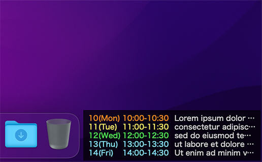

# Micro Calendar for Übersicht

Tiny calendar widget for [Übersicht](http://tracesof.net/uebersicht/) that displays iCal Events in the right/left space next to the macOS Dock.



## Font Colors

| Event Date | Font Color |
| :-- | :-- |
| Today | <span style="color:#ff871f">Orange (#FF871F)</span> |
| Tomorrow | <span style="color:#fae35f">Yellow (#FAE35F)</span> |
| The day after tomorrow | <span style="color:#4be34f">Green (#4BE34F)</span> |
| 3+ days later | <span style="color:#80d9fa">Blue (#80D9FA)</span> |


## Usage

1. Install [Übersicht](http://tracesof.net/uebersicht/)
1. Install [icalBuddy](https://hasseg.org/icalBuddy/)
    ```shell
    brew install icalBuddy
    ```
1. Place this widget at Übersicht widget folder:
    `/Users/<username>/Library/Application Support/Übersicht/widgets/`
1. (Optional) Change settings in `microcalendar.coffee`
    - icalBuddy install path
    - Show only specific calendars
    - Date and time format
    - Widget layout
    - Fonts
